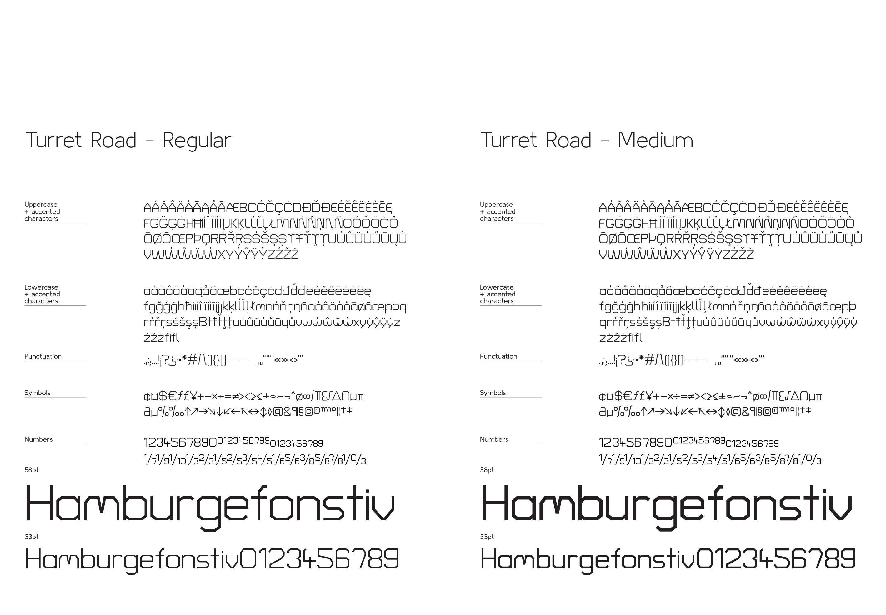

# Turret Road

Turret Road is a geometric sans serif typeface, with very low contrast, high x-height and gylph height, and playful diacritics.

Turret Road delves into eugenics, solar evolution, science fiction and homeward conversations.

### Project documentation
Turret Road is part of a larger series of site specific typefaces completed as part of a masters project. Further details regarding this typefaces development are available here, [Project overview](documentation/project-overview.md).

### Available weights
ExtraLight  
Light  
Regular  
Medium  
Bold  
ExtraBold 

